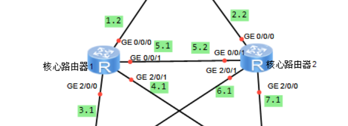
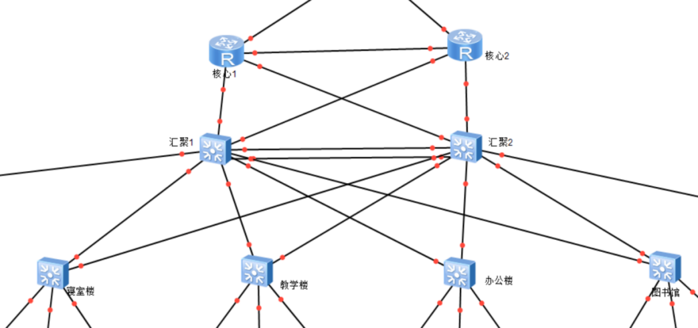
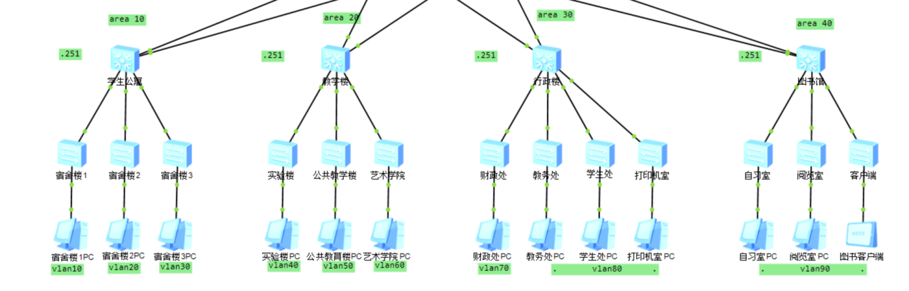
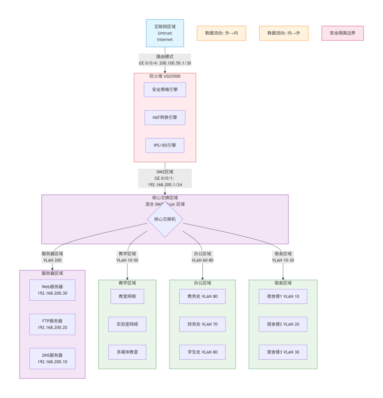
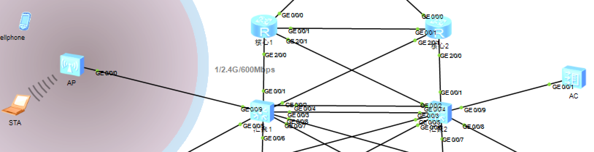
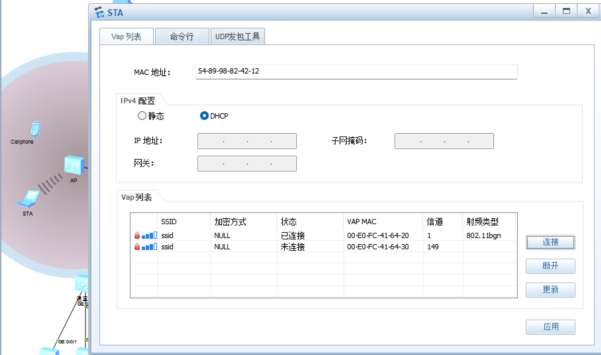
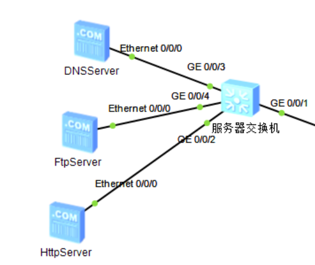
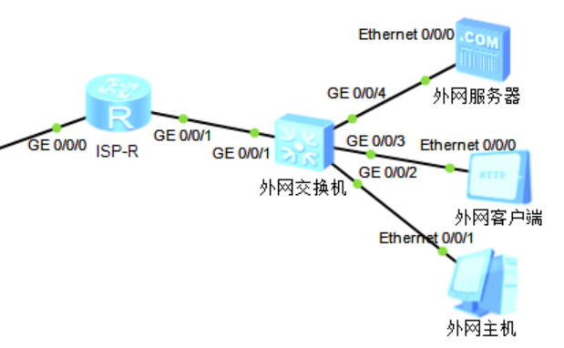

# 大连民族大学校园网总体设计实施方案
## 项目概述
本项目为网络工程专业课程设计，针对传统校园网络**广播域过大、无无线全覆盖、核心无冗余、内外网未隔离**四大痛点，基于华为全系列网络设备搭建中小型智慧校园三层网络，完整覆盖教学、科研、行政办公、学生宿舍、图书馆、DMZ服务器区、互联网出口七大业务场景。

全网采用双核心冗余架构消除单点故障，通过VLAN、防火墙区域策略实现业务逻辑隔离；部署AC+AP集中式无线架构实现校园无死角Wi-Fi覆盖；集成OSPF动态路由、MSTP防环路、Eth-Trunk链路聚合、VRRP网关备份、DHCP地址自动分发、NAT外网发布、802.1X接入认证等主流企业级网络技术，所有方案可在eNSP仿真平台完整复现，具备落地参考价值。

### 基础信息
- 设备型号：华为AR1220、S5700、USG5500、AC6605、AP6050
- 核心架构：三层分层架构（核心层-汇聚层-接入层）+ OSPF多区域动态路由
- 项目成果：完整实施方案Word报告、全套设备配置命令、全网拓扑图、设备调试截图、无线模块测试记录

## 一、项目需求分析
### 1.1 业务场景需求
1. **教学区域**：教室多媒体、线上直播课堂、录播系统，低延迟高带宽，有线无线双接入；
2. **科研区域**：大文件内网高速传输、VPN远程实验室访问、虚拟化仿真算力支撑；
3. **行政办公**：OA、邮件、多校区互通，精细化访问权限管控；
4. **学生生活区**：宿舍/食堂/图书馆高密度无线并发，智能带宽均衡；
5. **DMZ服务器区**：对外提供DNS、FTP、HTTP校园网站服务，内外网安全隔离；
6. **互联网出口**：统一外网访问，NAT地址转换，边界防火墙抵御网络攻击。

### 1.2 技术硬性需求
1. 分层架构：核心/汇聚/接入三层设计，隔离广播域，故障局部化；
2. 高可用冗余：双核心设备、链路聚合、VRRP网关备份，故障毫秒级切换；
3. 业务隔离：按楼栋划分独立VLAN，ACL控制跨网段访问权限；
4. 集中无线：AC统一管理所有AP，支持802.11r快速漫游，跨区域移动无断网；
5. 自动地址分配：全网DHCP+DHCP中继，自动下发IP、网关、DNS，避免地址冲突；
6. 多层安全防护：防火墙三区域隔离、WPA2无线加密、端口安全、802.1X准入认证；
7. 高效路由：OSPF多区域划分，Area0骨干区承载全网路由，降低路由泛洪。

### 1.3 性能指标需求
- 核心链路万兆转发，汇聚上联千兆链路聚合，单链路故障自动切换；
- 单台AP最大支持512终端并发，适配阶梯教室高密度接入场景；
- 核心设备故障切换毫秒级，业务无感知中断；
- 外网仅能访问DMZ开放服务，无法主动渗透教学科研内网；
- 预留充足VLAN、IP网段、端口资源，支持未来3-5年扩容。

## 二、方案对比与设备选型
### 2.1 网络架构方案对比
| 方案 | 架构类型 | 优势 | 劣势 | 适配场景 |
| ---- | ---- | ---- | ---- | ---- |
| 方案一（本项目选用） | 三层分层架构 | 故障隔离、扩容灵活、核心压力小、运维简单 | 设备投入略高于二层 | 万级终端高校校园网 |
| 方案二 | 扁平化二层架构 | 部署简单、初期成本低 | 广播域巨大、故障难排查、无法承载大量终端 | 小型培训机构、终端≤2000 |
| 方案三 | 大型模块化框式架构 | 性能极强、模块独立扩容 | 造价极高、运维复杂、资源过剩 | 超大型综合高校、城域网 |

### 2.2 无线组网方案对比
| 方案 | 架构 | 优势 | 劣势 |
| ---- | ---- | ---- | ---- |
| AC+AP集中管理（选用） | 集中隧道转发 | 统一运维、无缝漫游、射频自动优化、负载均衡 | 需要单独部署AC控制器 |
| 胖AP独立部署 | 单AP独立运行 | 单设备成本低 | 无漫游、高密度卡顿、逐台配置运维量大 |
| Mesh自组网 | 无线中继组网 | 无需布线 | 带宽损耗大、信号不稳定，仅适合临时场景 |

### 2.3 全套硬件设备清单
1. 核心层路由：华为AR1220（双核心冗余，OSPF骨干路由）
2. 汇聚交换机：华为S5700-28C-HI（两台，链路聚合、VLAN网关）
3. 接入交换机：华为S5700系列（POE供电，终端接入管控）
4. 边界防火墙：华为USG5500（Trust/Untrust/DMZ三区隔离、NAT、IPS、VPN）
5. 无线控制器AC：华为AC6605（最大管理1024台AP，CAPWAP隧道、漫游控制）
6. 无线AP：华为AP6050（双频802.11ac Wave2，单台512终端并发，POE供电）
7. DMZ服务器交换机：华为S3700-26C-HI（承载DNS/FTP/HTTP服务器）
8. 模拟运营商出口路由：华为AR1220

## 三、全网IP与VLAN规划
### 3.1 VLAN业务分区规划
| VLAN号 | 所属区域 | 业务用途 | 网段 | 网关地址 |
| ---- | ---- | ---- | ---- | ---- |
| VLAN10 | 学生宿舍1区 | 宿舍楼终端 | 192.168.10.0/24 | 192.168.10.254 |
| VLAN20 | 学生宿舍2区 | 宿舍楼终端 | 192.168.20.0/24 | 192.168.20.254 |
| VLAN30 | 公共教学区 | 教室、多媒体设备 | 192.168.30.0/24 | 192.168.30.254 |
| VLAN40 | 实验机房 | 上机实验室 | 192.168.40.0/24 | 192.168.40.254 |
| VLAN50 | 计算机学院 | 教师科研机房 | 192.168.50.0/24 | 192.168.50.254 |
| VLAN60 | 行政办公区 | 教务处、财务处 | 192.168.60.0/24 | 192.168.60.254 |
| VLAN70 | 财务处专属 | 财务内网终端 | 192.168.70.0/24 | 192.168.70.254 |
| VLAN80 | 学生处办公室 | 行政办公终端 | 192.168.80.0/24 | 192.168.80.254 |
| VLAN90 | 图书馆区域 | 自习室、借阅终端 | 192.168.90.0/24 | 192.168.90.254 |
| VLAN100 | 无线管理VLAN | AC与AP隧道通信 | 192.168.100.0/24 | 192.168.100.254 |
| VLAN101 | 无线业务VLAN | 手机、平板无线终端 | 192.168.101.0/24 | 192.168.101.254 |
| VLAN200 | DMZ服务器区 | DNS/FTP/HTTP公网服务 | 192.168.200.0/24 | 192.168.200.254 |

### 3.2 核心互联网段
- 核心路由器与防火墙互联：`192.168.1.0/24`、`192.168.2.0/24`
- 双核心路由器互联链路：`192.168.5.0/24`
- 核心与汇聚上联链路：`192.168.3.0/24`、`192.168.4.0/24`、`192.168.6.0/24`、`192.168.7.0/24`
- 互联网出口运营商链路：`200.100.50.0/30`

## 四、网络分层详细设计
### 4.1 核心层设计
1. 设备：双台华为AR1220路由器，全网路由冗余；
2. 核心功能：OSPF Area0骨干区域、跨VLAN三层转发、上联防火墙、下联两台汇聚交换机；
3. 冗余方案：双设备多链路互联，单核心故障流量自动切换至备用设备；
4. 配置内容：接口IP、OSPF全局路由宣告、外网静态路由；
5. 安全设计：路由白名单，仅可信网段同步路由，拦截非法路由条目。

### 4.2 汇聚层设计
1. 设备：两台华为S5700-28C-HI三层交换机；
2. 核心功能：区域流量聚合、VLANIF网关、DHCP中继、MSTP防环、Eth-Trunk链路聚合；
3. 冗余方案：双上联至两台核心路由器，VRRP网关备份；
4. 安全策略：端口安全、ACL流量过滤、带宽限速、802.1X接入认证；
5. 优化设计：OSPF Stub区域，精简路由表，降低设备负载。

### 4.3 接入层设计
1. 设备：华为S5700系列POE交换机；
2. 核心功能：终端接入、VLAN划分、Trunk上联汇聚、MSTP多实例划分；
3. 安全管控：端口隔离、非法MAC拦截、广播风暴抑制；
4. 扩容特性：预留空闲端口与备用VLAN，新增楼栋无需改动核心架构。

### 4.4 防火墙（USG5500）边界设计
1. 区域划分：Trust内网区、Untrust互联网区、DMZ服务器区；
2. 安全策略：内网可主动访问外网，外网禁止主动访问内网，仅放行DMZ 80/21端口；
3. NAT部署：静态NAT映射DMZ服务器，实现校园网站公网访问；
4. 附加功能：IPS入侵防御、SSL VPN远程办公、流量日志审计。

### 4.5 AC+AP无线组网（本人核心负责模块）
#### 4.5.1 设备架构
- AC控制器：AC6605，统一管理全网AP，下发无线配置、射频调节、漫游策略；
- AP接入点：AP6050，POE供电部署于教学楼、宿舍、图书馆，双频Wi-Fi；
- 隧道协议：CAPWAP隧道，管理流量VLAN100，用户业务流量VLAN101。

#### 4.5.2 完整配置流程
1. 批量创建管理、业务VLAN，配置VLANIF三层接口IP；
2. 指定CAPWAP源接口，配置静态路由保证AC与AP跨网段互通；
3. 全局启用DHCP，划分AP管理地址池、无线终端地址池；
4. WLAN模板搭建：SSID模板、WPA2-PSK加密安全模板、VAP转发模板；
5. AP通过MAC地址注册入AP分组，批量下发无线配置；
6. 开启802.11r快速漫游，跨AP移动网络无断流。

#### 4.5.3 安全与特色设计
- 安全：无线用户隔离、非法AP拦截、802.1X账号认证；
- 优化：AC自动调整AP信道与发射功率，规避信号干扰；
- 高可用：AC支持1+1热备，主控制器故障备份自动接管无线业务。

### 4.6 DMZ区+互联网出口
1. DMZ区：独立交换机承载DNS、FTP、HTTP服务器，隔离内网，仅开放必要公网端口；
2. 互联网出口：AR1220模拟运营商路由，对接防火墙外网口；
3. 隔离策略：内网可访问DMZ服务器，DMZ服务器无法主动访问教学科研内网。

## 五、核心网络技术汇总
1. **VLAN虚拟局域网**：按业务/楼栋分割广播域，隔离故障、抑制广播风暴；
2. **DHCP动态地址分配**：自动下发IP参数，减少人工运维，避免地址冲突；
3. **Eth-Trunk链路聚合**：多条物理链路捆绑，提升带宽同时实现链路冗余；
4. **MSTP多生成树**：二层冗余链路防环路，多VLAN负载均衡，收敛速度快；
5. **VRRP虚拟网关**：双网关冗余，网关故障终端无感知切换；
6. **OSPF动态路由**：多区域分层路由，大型校园网自动学习路由，简化运维；
7. **CAPWAP隧道技术**：AC集中管控AP，无线数据统一转发，便于安全管控；
8. **防火墙三区域隔离**：内网、外网、服务器区逻辑隔离，抵御外网攻击；
9. **NAT网络地址转换**：内网服务器公网发布，节约公网IP地址；
10. **ACL访问控制列表**：精细化管控不同VLAN之间互访权限。

## 六、方案测试验证结果
1. **冗余可靠性测试**：手动关闭单台核心路由器/单条上联链路，全网业务无中断，切换毫秒级完成；
2. **跨VLAN通信测试**：同业务VLAN正常互通，跨业务VLAN按ACL策略限制非法访问；
3. **无线功能测试**：AP全部成功注册AC，SSID正常广播，终端可正常连接，跨AP漫游无掉线；
4. **外网访问测试**：内网终端可正常访问互联网，DMZ网站外网可访问，外网无法渗透内网；
5. **环路防护测试**：接入层冗余链路自动阻塞，无广播风暴，设备CPU负载正常；
6. **路由收敛测试**：OSPF路由自动学习，新增网段路由表实时更新，无路由缺失。

## 七、工程社会责任分析
从**社会、健康、安全、法律、文化**五个维度分析校园网工程正向作用与潜在风险，梳理设备选型、部署、运维全流程制约因素，明确设计、施工、运营方需承担的民事、行政、刑事责任，严格遵循《网络安全法》《数据安全法》《个人信息保护法》，完整详细内容见Word报告第三部分。

## 八、总结
本项目搭建一套标准化三层智慧校园网络解决方案，硬件选型匹配中小型高校预算与业务规模；双核心、链路聚合、VRRP等冗余设计保障网络高可用；VLAN、防火墙、无线加密多层防护保障内网数据安全；AC+AP集中无线架构解决校园高密度无线接入痛点。

整套方案全部采用华为设备标准配置命令，可直接在eNSP仿真环境完整复现，理论结合仿真实践，可为同类校园网络课程设计、小型园区网络改造提供完整参考案例。

